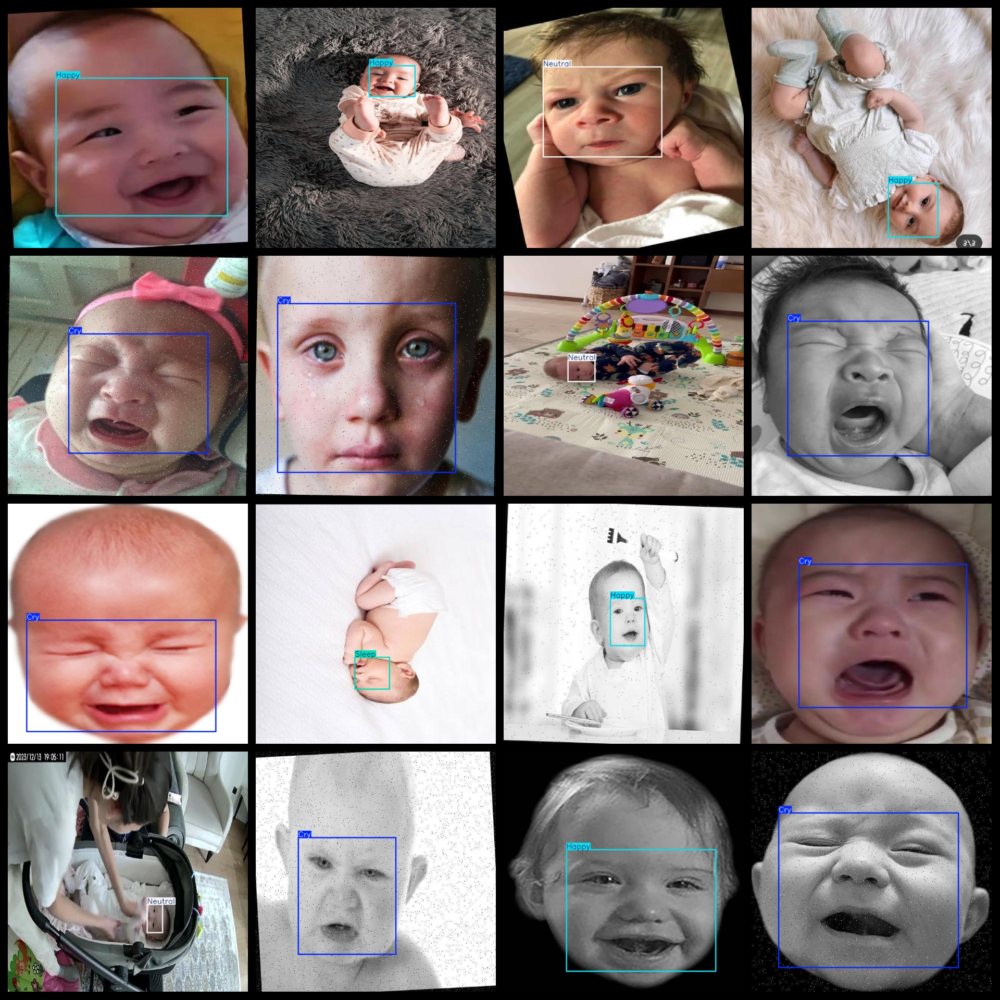

# Infant Expression Detection Dataset 5591 imagesVOC+YOLO

Infant Expression Detection Dataset 5591stretchVOC+YOLO

Dataset format: Pascal VOC format + YOLO format (the txt file does not contain the split path, it only contains jpg images and corresponding VOC format xml files and yolo format txt files)

Number of images (number of jpg files): 5591

Number of xml files: 5591

Number of annotations (number of txt files): 5591

Number of annotated categories: 4

The Github repository is: datasets_sl

["Cry", "Happy", "Neutral", "Sleep"]

Number of boxes labeled in each category:

Cry frame count = 1493

Happy Frame Count = 2022

Neutral Frame Count = 1361

Sleep Frame Count = 819

Total frame count: 5695

Number of images per category:

Cry occupies 1481 pictures.

Happy occupies 1979 pictures.

Neutral occupancy of images = 1325

Sleep occupies the image count = 814

Image resolution: 640x640

Use the labeling tool: labelImg

Dataset Augmentation: Yes

Rules for annotation: Draw a rectangle around the category.

Important note: The dataset does not have been divided into training, validation, and testing sets.

Special Disclaimer: This dataset does not guarantee the accuracy of the trained models or weight files.

Annotation and image details are as follows:

## Images

---

Here is a pay link on Stripe (https://buy.stripe.com/3cs8yP7sY87d0vu9AB). Please contact me lonlonago@foxmail.com after funding $89, and I will send you a complete data files, thank you!

